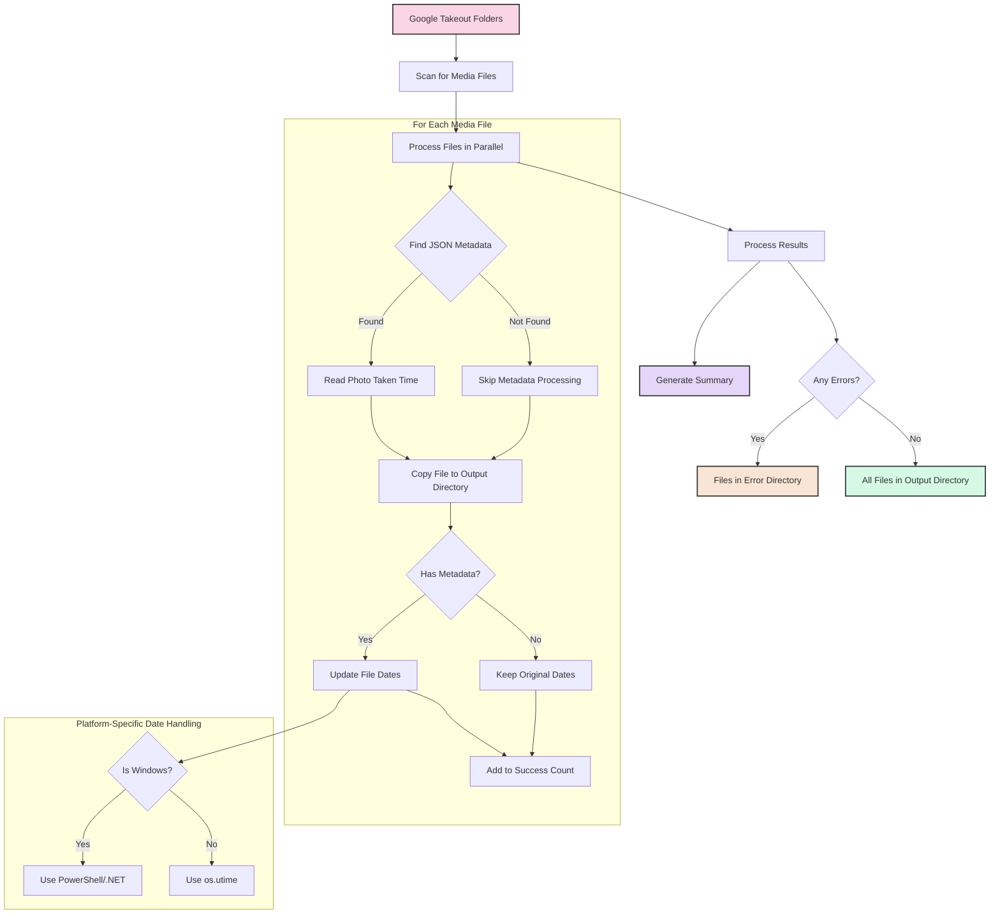

# Google Takeout Fix

A tool to fix file dates in Google Takeout exports, particularly for Google Photos.

## Overview

When you download your photos from Google Photos using Google Takeout, the file creation and modification dates are set to the date of the download, not the date the photo was taken. This tool fixes that by reading the metadata from the JSON files that accompany each photo and setting the file dates accordingly.


## Features

- Processes Google Photos Takeout folders
- Fixes file creation and modification dates based on JSON metadata
- Supports a wide range of media file types
- Handles Windows and non-Windows platforms differently
- Provides progress reporting with a progress bar
- Parallel processing support for faster operation on SSD/NVMe drives

## Requirements

- Python 3.6+
- pywin32 (for Windows file date handling only)

## Installation

### Windows

1. Clone or download this repository
2. Run the installation script:

```cmd
install.bat
```

This will check if Python is installed and install the required dependencies.

### Linux/Mac

1. Clone or download this repository
2. Make the installation script executable and run it:

```bash
chmod +x install.sh
./install.sh
```

This will detect your package manager (apt, dnf, yum, or brew), check if Python is installed, and install it if needed.

Alternatively, you can manually install the dependencies:

```bash
pip install tqdm
```

Note: pywin32 is only required for Windows systems.

## Usage

### Basic Usage

```bash
python google-fix.py -i "input_folder" -o "output_folder" -e "error_folder" [-p threads]
```

Parameters:
- `-i, --input-dir`: Directory containing the extracted contents of Google Photos Takeout
- `-o, --output-dir`: Directory into which the processed output will be written
- `-e, --error-dir`: Directory for any files that have errors during processing (IMPORTANT: use -e, not -o)
- `-p, --parallel`: Number of parallel processes to use (default: 1)

Thread count recommendations:
- Default (1 thread): Safe for all systems
- 4 threads: Good for quad-core systems with an SSD
- 8 threads: Good for octa-core systems with an NVMe drive

### Linux/Mac Examples

```bash
# Basic usage with default thread count (1)
python google-fix.py -i "~/Takeout 10gb Feb 12" -o "~/complete/take 14" -e "~/error"

# Using 4 threads for faster processing on an SSD
python google-fix.py -i "~/Takeout 10gb Feb 12" -o "~/complete/take 14" -e "~/error" -p 4
```

### Windows PowerShell Examples

In PowerShell, you MUST use the equals sign format with no space between flag and path:

```powershell
# Basic usage with default thread count (1)
python .\google-fix.py -i="D:\Takeout Files" -o="D:\Finished Files" -e="D:\Error Files"

# Using 4 threads for faster processing on an SSD
python .\google-fix.py -i="D:\Takeout Files" -o="D:\Finished Files" -e="D:\Error Files" -p=4
```

> **IMPORTANT NOTES FOR POWERSHELL USERS**: 
> 1. Always use the equals sign format (`-flag=value`) without spaces
> 2. Do not include trailing backslashes in your paths
> 3. Make sure to use `-e` for the error directory, not `-o`
> 4. The script requires three separate directories specified with `-i`, `-o`, and `-e`
> 5. Double quotes are recommended for paths with spaces


## Architecture



## How It Works

1. The script scans the input directory for media files
2. For each media file, it looks for a corresponding JSON metadata file
3. It reads the photo taken time from the JSON metadata
4. It copies the media file to the output directory
5. It updates the file creation and modification dates based on the metadata
6. If there are any errors, the file is moved to the error directory
7. After processing, a summary is displayed including a sample file with its original and updated dates

The script supports various JSON metadata file naming patterns found in Google Takeout exports:
- file.jpg.json
- file.jpg.suppl.json
- file.mp4.supplemental-metadata.json
- file.json (where file is without extension)
